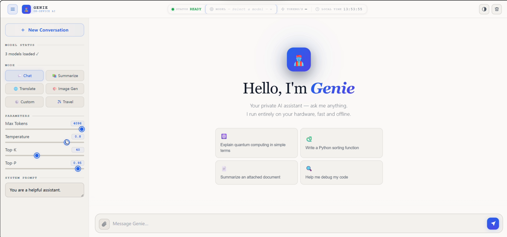
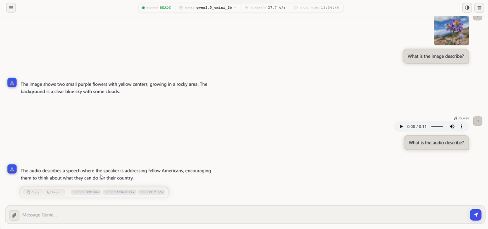

<br>

<div align="center">
  <h3>Run WebUI AI Applications Locally on NPU</h3>
  <p><i> SIMPLE | EASY | FAST </i></p>
</div>
<br>

## Disclaimer
This software is provided "as is," without any express or implied warranties. The authors and contributors shall not be held liable for any damages arising from its use. The code may be incomplete or insufficiently tested. Users are solely responsible for evaluating its suitability and assume all associated risks.<br>
Note: Contributions are welcome. Please ensure thorough testing before deploying in critical systems.

---

## Introduction

This directory contains three Gradio-based WebUI applications that run AI models locally on the Snapdragon NPU (HTP) via QAI AppBuilder on **Windows on Snapdragon (WoS)** platforms:

| App | Port | Model | Description |
|-----|------|-------|-------------|
| [ImageRepairApp.py](#1-imagerepairapp) | 8977 | Real-ESRGAN General x4v3 | Image super-resolution with before/after slider comparison |
| [StableDiffusionApp.py](#2-stablediffusionapp) | 8978 | Stable Diffusion v2.1 | Text-to-image generation |
| [GenieWebUI.py](#3-geniewebui) | 50000 | LLM (via GenieAPIService) | Multi-function LLM chat app |

### Screenshots

| ImageRepairApp | StableDiffusionApp | GenieWebUI |
|-----------------|---------------------|------------|
|  |  |  |

---

## Environment Setup

### Step 1: Install Python (x64)

Refer to [python.md](../../docs/python.md) for instructions on setting up the **x64** Python environment on WoS.

> **Note:** Use the **x64** version of Python (not ARM64), as QAI AppBuilder requires x64 Python on WoS.

You can also use the [QAI AppBuilder Launcher](../../tools/launcher/) batch file to set up the environment automatically.

### Step 2: Install QAI AppBuilder and QNN Libraries

Run the following commands in a Windows terminal:

```
cd qai-appbuilder\samples\common
python setup.py
```

This automatically downloads and installs the QAI AppBuilder Python package and the required QNN runtime libraries for your device.

### Step 3: Install Python Dependencies for WebUI

Run the following command in a Windows terminal:

```
pip install gradio==5.35.0 qai_hub_models==0.30.2 huggingface_hub==0.33.1 Pillow==10.4.0 numpy==1.26.4 opencv-python==4.10.0.84 torch==2.4.1 torchvision==0.19.1 torchaudio==2.4.1 transformers==4.46.3 diffusers==0.32.2 langchain-community==0.3.27
```

### Step 4: Switch to the `samples` Directory

All WebUI apps must be launched from the `samples/` directory:

```
cd qai-appbuilder\samples
```

> **Important:** Always run the apps from the `samples/` directory, not from `samples/webui/`. The batch files (`start_*.bat`) handle this automatically.

### Troubleshooting: Gradio 403 Startup Error

If you see the following error when launching any WebUI app:

```
Exception: Couldn't start the app because 'http://localhost:<port>/gradio_api/startup-events' failed (code 403).
Check your network or proxy settings to ensure localhost is accessible.
```

This is caused by a system or corporate proxy intercepting `localhost` traffic. The apps already include a fix that sets `NO_PROXY=localhost,127.0.0.1` before launching. If the issue persists, set the environment variable manually before running:

```
set NO_PROXY=localhost,127.0.0.1
set no_proxy=localhost,127.0.0.1
python webui\ImageRepairApp.py
```

---

## App Details

### 1. ImageRepairApp

**File:** `webui\ImageRepairApp.py`  
**Port:** 8977  
**Model:** Real-ESRGAN General x4v3 (4× super-resolution)

#### Features
- Upload an image from local file, clipboard, or webcam
- Runs Real-ESRGAN General x4v3 on the Snapdragon NPU to upscale the image 4×
- Interactive before/after slider to compare original and repaired image side by side
- Save the repaired image to a local folder via a file dialog
- Dark mode UI

#### How to Run

**Option A — Command line (from `samples/` directory):**
```
cd qai-appbuilder\samples
python webui\ImageRepairApp.py
```

**Option B — Double-click batch file:**
```
samples\webui\start_ImageRepairApp.bat
```

The app opens automatically in your browser at `http://localhost:8977`.

#### Step-by-Step Usage

1. **Launch the app** using one of the methods above. The first launch downloads the model automatically (~100 MB). Wait for the terminal to show `* Running on local URL: http://0.0.0.0:8977`.
2. **Select an image** in the left panel:
   - Click the image upload area and choose a PNG, JPEG, or other image file from your local folder, OR
   - Paste an image from the clipboard (click the clipboard icon), OR
   - Capture a photo using your webcam (click the camera icon).
3. **Click "Repair Picture 🚀️"** to run super-resolution inference on the NPU. Processing takes about 1–2 seconds.
4. **Compare results** using the slider in the main panel — drag left/right to reveal the original (left) vs. repaired (right) image.
5. **Save the result** by clicking "Save Picture 💿" and choosing a save location in the file dialog.

#### Notes
- Supported input formats: JPEG, PNG, BMP, and other PIL-supported formats (automatically converted to JPEG internally).
- The model runs on the Snapdragon HTP (NPU). On non-Snapdragon hardware it falls back to CPU.
- Temporary files are stored in `samples/images/old.jpeg` (original) and `samples/images/new.jpeg` (repaired).

---

### 2. StableDiffusionApp

**File:** `webui\StableDiffusionApp.py`  
**Port:** 8978  
**Model:** Stable Diffusion v2.1 (text-to-image)

#### Features
- Generate images from English text prompts using Stable Diffusion v2.1 on the NPU
- Supports positive and negative prompts
- Configurable inference steps, text guidance scale, random seed, and batch count
- Gallery view for generated images
- Dark mode UI

#### Prerequisites — Download SD v2.1 Models

The Stable Diffusion v2.1 models must be downloaded manually from [Qualcomm AI Hub](https://aihub.qualcomm.com/compute/models/stable_diffusion_v2_1) before running the app.

1. Go to [AI Hub — Stable Diffusion v2.1](https://aihub.qualcomm.com/compute/models/stable_diffusion_v2_1).
2. Select **Runtime: Qualcomm® AI Engine Direct** and **Device: Snapdragon® X Elite**.
3. Download the following three model components:
   - `TextEncoderQuantizable`
   - `UnetQuantizable`
   - `VaeDecoderQuantizable`
4. Save the downloaded `.bin` files to:
   ```
   qai-appbuilder\samples\GenerativeAI\Image_Generation\stable_diffusion_v2_1\models\
   ```

#### How to Run

**Option A — Command line (from `samples/` directory):**
```
cd qai-appbuilder\samples
python webui\StableDiffusionApp.py
```

**Option B — Double-click batch file:**
```
samples\webui\start_StableDiffusionApp.bat
```

The app opens automatically in your browser at `http://localhost:8978`.

#### Step-by-Step Usage

1. **Launch the app** using one of the methods above. Wait for the terminal to show `* Running on local URL: http://0.0.0.0:8978`.
2. **Enter a prompt** in the "Prompt" text box (English only). Example: `a beautiful sunset over the ocean, photorealistic`.
3. *(Optional)* **Enter a negative prompt** in the "Negative Prompt" text box to exclude unwanted elements. Example: `blurry, low quality, distorted`.
4. *(Optional)* **Adjust generation parameters:**
   - **迭代步数 (Steps):** Number of diffusion steps (1–50, default 20). More steps = higher quality but slower.
   - **文本指导 (Text Guidance):** CFG scale (5.0–15.0, default 7.5). Higher = closer to prompt.
   - **随机数种子 (Seed):** Random seed (-1 for random, or a fixed integer for reproducible results).
   - **图片数量 (Count):** Number of images to generate (1–12, default 2).
5. **Click "开始生图 🚀"** to start generation. Each image takes about 20–30 seconds on the NPU.
6. **View results** in the gallery below. Click any image to view it full size.

#### Notes
- Only **English prompts** are supported.
- Output images are 512×512 pixels.
- Generated images are saved to `samples\webui\images\`.
- The model uses `QNNShareMemory` for efficient NPU memory management.

---

### 3. GenieWebUI

**File:** `webui\GenieWebUI.py`  
**Port:** 50000 (Gradio UI) + 8910 (GenieAPIService backend)

#### Features
- Multi-function LLM chat interface powered by large language models running on the NPU
- **Q & A** — General question answering
- **Doc Summary** — Summarize uploaded PDF, DOCX, PPTX, TXT, MD, or source code files
- **AI Translation** — Translate text between languages
- **AI Searching** — Web-augmented search answers
- **Writing Assistant** — Help with writing tasks
- **Text To Image** — Generate images via Stable Diffusion (requires StableDiffusionApp running)
- **Customerized Function** — Custom system prompt mode
- Configurable generation parameters: Max Length, Temperature, Top-K, Top-P
- Real-time performance metrics: first token latency, prompt tokens/s, eval tokens/s
- Multimodal input: text, images (PNG/JPG), and audio (WAV)
- Model switching at runtime

#### Screenshots

| Chat Home | Multimodal Chat (Image & Audio) |
|-----------|----------------------------------|
|  |  |

#### Prerequisites — Set Up GenieAPIService

GenieWebUI is a **frontend only**. It connects to `GenieAPIService` (running on port 8910) as its LLM backend. You must start `GenieAPIService` before launching `GenieWebUI`.

**Step 1: Install GenieAPIService dependencies**

```
pip install uvicorn==0.34.0 pydantic_settings==2.10.1 fastapi==0.115.8 langchain==0.3.19 langchain_core==0.3.45 langchain_community==0.3.18 sse_starlette==2.2.1 pypdf==5.3.0 python-pptx==1.0.2 docx2txt==0.8 openai==1.63.2 json-repair==0.47.4
```

**Step 2: Download an LLM model**

Download one of the supported models and place the files in the corresponding directory:

| Model | Download Source | Directory |
|-------|----------------|-----------|
| IBM Granite v3.1 8B | [Qualcomm AI Hub](https://aihub.qualcomm.com/compute/models/ibm_granite_v3_1_8b_instruct) | `samples\genie\python\models\IBM-Granite-v3.1-8B\` |
| Phi 3.5 Mini Instruct | [Qualcomm AI Hub](https://aihub.qualcomm.com/compute/models/phi_3_5_mini_instruct) | `samples\genie\python\models\Phi-3.5-mini\` |
| Qwen2-7B-SSD | [aidevhome.com](https://www.aidevhome.com/data/adh2/models/suggested/Qwen2.0-7B-SSD-8380-2.34.zip) | `samples\genie\python\models\Qwen2.0-7B-SSD\` |
| Llama 3.2 3B | [aidevhome.com](https://www.aidevhome.com/data/adh2/models/suggested/llama3.2-3b-8380-qnn2.37.zip) | `samples\genie\python\models\llama3.2-3b\` |

- Select **Snapdragon® X Elite** as the device when downloading from AI Hub.
- Unzip the `weight_sharing_model_N_of_N.serialized.bin` files and copy them to the model directory.
- Copy the corresponding `tokenizer.json` to the same model directory.
- See [genie/python/README.md](../genie/python/README.md) for full model setup instructions.

**Step 3: Start GenieAPIService** (keep this terminal open)

```
cd qai-appbuilder\samples
python genie\python\GenieAPIService.py --modelname "IBM-Granite-v3.1-8B" --loadmodel --profile
```

Wait until you see:
```
INFO:     model <<< IBM-Granite-v3.1-8B >>> is ready!
INFO:     Uvicorn running on http://0.0.0.0:8910 (Press CTRL+C to quit)
```

#### How to Run GenieWebUI

**Option A — Command line (from `samples/` directory, in a new terminal):**
```
cd qai-appbuilder\samples
python webui\GenieWebUI.py
```

**Option B — Double-click batch file:**
```
samples\webui\start_GeneWebUI.bat
```

The app opens automatically in your browser at `http://localhost:50000`.

#### Step-by-Step Usage

1. **Start GenieAPIService** first (see prerequisites above).
2. **Launch GenieWebUI** in a separate terminal window.
3. **Connect to the model:**
   - In the left sidebar, select your model from the **Active Model** dropdown.
   - Click **"🔗 Connect"** and wait for the status to show the model is ready.
4. **Choose a function mode** by clicking one of the function buttons above the chat input:
   - **📐 Q & A** — Ask any question
   - **📚 Doc Summary** — Upload a document file and click to summarize
   - **🗛 AI Translation** — Enter text to translate
   - **🌐 AI Searching** — Ask questions that require web search
   - **✒️ Writing Assistant** — Get writing help
   - **🎨 Text To Image** — Generate an image from a text description
   - **🍸 Customerized Function** — Enter a custom system prompt in the sidebar
5. **Type your message** in the input box at the bottom and press Enter (or click Send).
6. *(Optional)* **Attach files or images** by clicking the attachment icon in the input box.
7. *(Optional)* **Adjust generation parameters** in the left sidebar (Max Length, Temperature, Top-K, Top-P).
8. **Monitor performance** in the left sidebar: first token latency, prompt processing speed, and generation speed.
9. **Clear the chat** by clicking the 🗑️ button.

#### Notes
- GenieWebUI requires `GenieAPIService` to be running on port 8910 before it can process any requests.
- The **Text To Image** function additionally requires `StableDiffusionApp` to be running on port 8978.
- Supported file types for Doc Summary: `.pdf`, `.docx`, `.pptx`, `.txt`, `.md`, `.py`, `.c`, `.cpp`, `.h`, `.hpp`
- Supported image types: `.png`, `.jpg`, `.jpeg`
- Supported audio types: `.wav`
- For full GenieAPIService setup and model configuration, see [genie/python/README.md](../genie/python/README.md).

---

## Quick Reference

### Launch Commands (from `samples/` directory)

```
# Image Repair App
python webui\ImageRepairApp.py

# Stable Diffusion App
python webui\StableDiffusionApp.py

# Genie WebUI (start GenieAPIService first!)
python genie\python\GenieAPIService.py --modelname "IBM-Granite-v3.1-8B" --loadmodel --profile
python webui\GenieWebUI.py
```

### Batch Files (double-click to launch)

| Batch File | App |
|-----------|-----|
| `webui\start_ImageRepairApp.bat` | ImageRepairApp |
| `webui\start_StableDiffusionApp.bat` | StableDiffusionApp |
| `webui\start_GeneWebUI.bat` | GenieWebUI |

### Access URLs

| App | URL |
|-----|-----|
| ImageRepairApp | http://localhost:8977 |
| StableDiffusionApp | http://localhost:8978 |
| GenieWebUI | http://localhost:50000 |
| GenieAPIService (backend) | http://localhost:8910 |

---

## Platform Requirements

- **OS:** Windows on Snapdragon (WoS) — ARM64 Windows 11
- **Hardware:** Snapdragon® X Elite or Snapdragon® X2 Elite (for NPU acceleration)
- **Python:** x64 Python 3.10+ (see [python.md](../../docs/python.md))
- **Gradio:** 5.35.0

> On non-Snapdragon hardware (x86 Windows), the models fall back to CPU execution and will be significantly slower.
